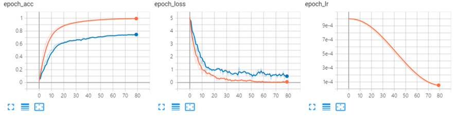

# **Evasion attack**

## **Abstract**

본 저장소는 제5회 금융보안원 논문공모전에 출품한 논문 "**목소리를 이용한 심층신경망 기반 생체인증 시스템에의 회피 공격**: 정성적 평가의 수행 및 교차 검증에 대한 절제연구를 중심으로"의 실험 과정 및 결과 재현을 위한 자료입니다. 당해 저장소의 주요 목적은 아래와 같습니다.

1. 논문에서 제시된 실험 과정 및 구현 결과의 재현성 증빙
2. 코드 공유를 통해 관련 분야에 대한 신진 연구자들의 접근 장벽 완화

모든 코드는 최초에 작성되었던 `*.ipynb` 확장자의 파일들을 `*.py` 형태로 리팩토링하는 과정에서 약간의 개선 작업이 이루어졌으므로, 실제 실험 결과는 논문에서 제시된 결과와 비슷하거나 약간 좋을 수 있습니다.

## **Requirements**

본 실험은 `Linux Ubuntu 20.04`에서 진행되었습니다. 실험 과정 및 결과에 중대한 영향을 미칠 수 있는 주요 라이브러리의 버전은 아래와 같습니다.

```
python==3.7.10
tensorflow-gpu==2.5.0
tensorflow-addons==0.13.0
cleverhans==4.0.0
```

이를 포함한 라이브러리는 아래와 같이 설치할 수 있습니다.

```
python -m pip install --upgrade pip
pip install -r requirements.txt
```

현재 `adablief_tf` 설치를 진행하면 최신 버전의 `tensorflow-cpu`가 강제 설치되는 이슈가 있습니다. 작성일인 2021.08.25 기준 `tensorflow-cpu==2.6.0`이 설치되므로, 해당 라이브러리를 지운 뒤 다시 한 번 설치해주어야 합니다.

```
pip uninstall tensorflow
pip install -r requirements.txt
```

## **Prepare Dataset**

본 저장소에는 `VoxCeleb1` 데이터세트를 다운로드하는 코드가 포함되어 있지 않습니다. 따라서 <a href="https://www.robots.ox.ac.uk/~vgg/data/voxceleb/">`VoxCeleb`</a>를 참고하셔서 필요한 데이터를 다운 및 병합하셔야 합니다. 모든 데이터는 폴더 `./data`에 위치해야 하며, 아래 초기 상태에 맞게 데이터가 준비된 상태를 권장합니다.

```
data
├── [4.7M]  iden_split.txt
├── [2.2M]  veri_test.txt
├── [ 30G]  vox1_dev_wav.zip
└── [1023M]  vox1_test_wav.zip

0 directories, 4 files
```

## **Generate TFRecords**

10만개 이상의 파일을 매 에폭마다 참조하는 것은 입출력 오버헤드가 매우 크기 때문에, 효율적인 입출력 파이프라인 관리를 위해 5000개씩 음성 발화를 묶은 이진 바이트 형태의 레코드 파일 `TFRecordDataset (*.tfrec)`을 사전에 준비합니다. 이에 대한 추가적인 설명은 <a href="https://www.tensorflow.org/tutorials/load_data/tfrecord">`TensorFlow Tutorial`</a>을 참고하시기 바랍니다.

```
python ./preliminary.py --unzip --generate_tfrecords
```

세부적인 파라미터는 <a href="./config/preliminary.json">`./config/preliminary.json`</a>을 참고 바랍니다.

## **Modeling**

본 화자 검증 및 식별 단계에서 사용되는 모델 아키텍쳐는 기본적으로 <a href="https://github.com/clovaai/voxceleb_trainer">`Clova AI Baseline`</a>의 골자를 따릅니다. PyTorch로 구현된 내용을 TensorFlow로 옮기는 과정에서 얼마간의 수정/개선이 이루어졌기 때문에, 실험 결과를 완벽하게 재현하지는 못했습니다.

## **Train, Inference, and Evaluate**

훈련, 추론 및 평가 과정은 한번에 이루어집니다. 아래와 같은 명령어를 통해 파라미터를 제어하여 훈련을 진행할 수 있습니다.

* Idenfitication Phase:

    ```
    python ./train.py --model_type iden --train_model --epochs 80 --batch_size 64
    ```

* Verification Phase:

    ```
    python ./train.py --model_type veri --train_model --epochs 80 --batch_size 64
    ```

세부적인 파라미터는 <a href="./config/train.json">`./config/train.json`</a>을 참고 바랍니다.

훈련은 NVIDIA RTX 3070 GPU (computing capicity=8.6) 기준, identification model은 약 10시간 50분, verification model은 약 10시간 15분이 소요되었습니다. 전체 데이터의 개수는 동일하지만, Training/Validation 데이터 분할 비율이 다르기 때문에 얼마간의 훈련 시간 차이가 존재합니다.

<a href="https://www.tensorflow.org/guide/mixed_precision?hl=ko">`Mixed Precision`</a>을 적용한다면 훈련 속도가 훨씬 단축될것으로 예상되지만, 일부 가중치의 발산 문제를 해결하지 못해 적용하지 못했습니다. 구체적으로 `AngularPrototypical.w`는 양의 방향으로, `AngularPrototypical.b`는 음의 방향으로 커지는 현상이 발생하였습니다.

훈련 결과는 아래와 같습니다.

* Idenfitication Model:

    

* Verification Model:

    

훈련에 대한 성능 차이는 Training/Validation 데이터세트의 비율 차이에서 기인한 것으로 판단됩니다. Identification 데이터세트는 사전에 정해진 Training/Validation Split을 따랐지만, Verification 데이터세트는 8:2로 임의 분할하여 훈련에 사용하였습니다.

모든 훈련 결과는 <a href="https://tensorboard.dev/experiment/1ZK5m6GiQrKdOeUOiJM0Dw">`Tensorboard.Dev`</a>에 공개적으로 커밋(Commit)하였습니다.

추론(Inference)은 주어진 모델과 그에 맞는 데이터세트로부터 `y_true` 및 `y_pred`를 계산하는 과정입니다. 이는 `{MODEL_TYPE}-{DATASET_TYPE}-{ATTACK_TYPE}-{EPSILON}.npz` 포맷으로 `./results/`에 자동 저장됩니다. 아무런 공격이 수행되지 않았으므로, 실제로는 `./results/iden-fixed-None-None.npz` 등의 형태로 저징될 것이라 예측할 수 있습니다.

평가(Evaluate)는 `y_true` 및 `y_pred` 텐서에 기반해서 평가를 수행하는 과정입니다. 식별, 검증 모델에 따른 구현된 평가 내용은 아래와 같습니다.

* Common: $$\text{dB}_x \left( \delta \right)$$

* Identification: Top-1 Accuracy, Top-5 Accuracy (based on CMC Curve)

* Verification: EER, AUROC, minDCF

## **Adversarial Attack**

적대적 공격에 관한 실험은 진행하는데 오랜 시간이 소요되기 떄문에, 자체 서버를 활용하여 오랜 시간 코드를 실행하시거나 Jupyter Lab 등의 환경을 이용하여 단계별로 진행하시는 것을 권장합니다.

본 단계에서는 클라우드 컨테이너 개발 환경인 `Google Colab (Pro)`의 Jupyter Lab에서 다중 세션을 활용하여 실험을 진행했으며, `Colab`에서는 Tesla P100 (또는 V100) GPU와 12GB RAM이 제공됩니다.

적대적 공격은 <a href="https://github.com/cleverhans-lab/cleverhans">`CleverHans`</a>에 구현되어 있는 FGSM 및 PGD 공격을 참조하였습니다.
